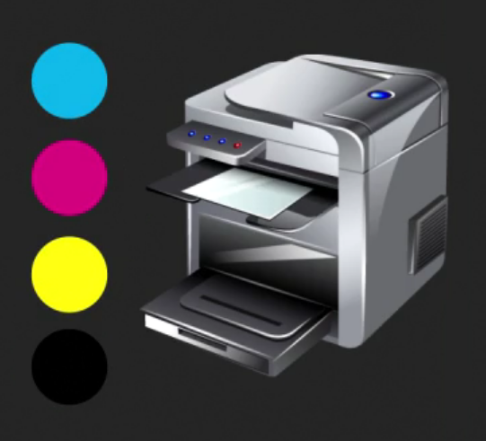
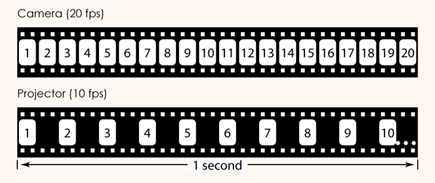
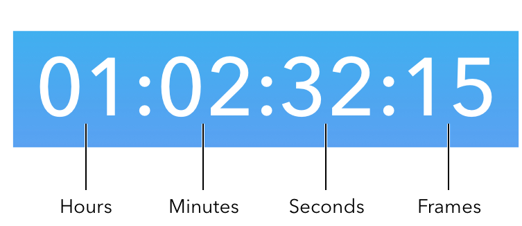
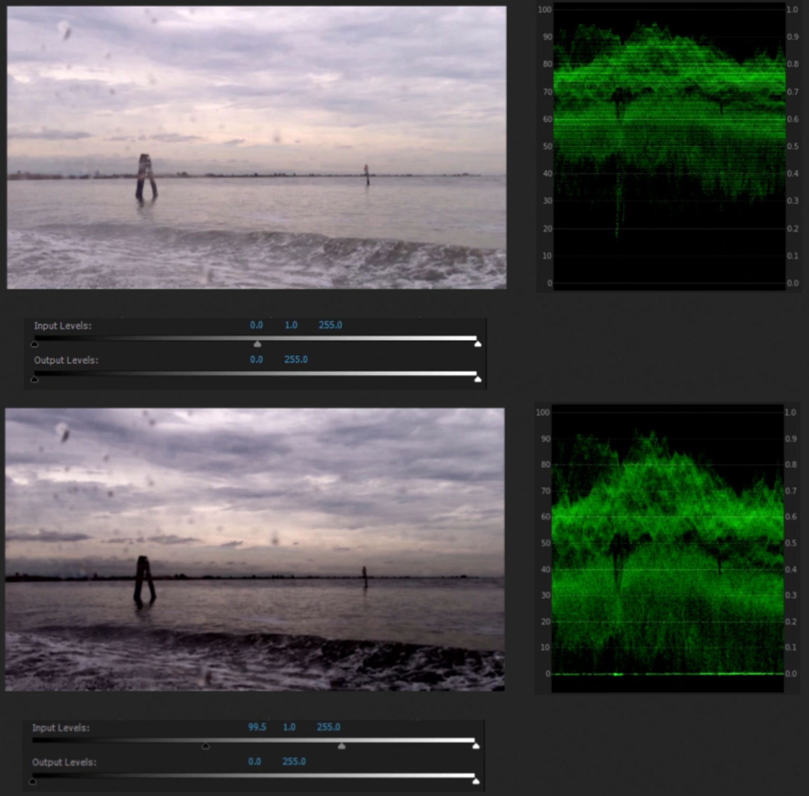

-------------------------------------------------------------------------------
# Digital Media Foundations

**Source**: [Digital Media Foundations (LinkedIn Learning)](https://www.linkedin.com/learning/digital-media-foundations) by Maxim Jago

<!-- MarkdownTOC -->

- [1. Images](#1-images)
    - [1.1. Pixels](#11-pixels)
    - [1.2. Brightness](#12-brightness)
    - [1.3. Bit depth](#13-bit-depth)
    - [1.4. Depth of field](#14-depth-of-field)
- [2. Color](#2-color)
    - [2.1. Color modes](#21-color-modes)
    - [2.2. RGB mode](#22-rgb-mode)
    - [2.3. YUV mode](#23-yuv-mode)
    - [2.4. RGB vs YUV](#24-rgb-vs-yuv)
    - [2.5. CMYK mode](#25-cmyk-mode)
    - [2.6. Color picker](#26-color-picker)
    - [2.7. Alpha channel](#27-alpha-channel)
    - [2.8. Luma key and chroma key](#28-luma-key-and-chroma-key)
    - [2.9. Blend modes](#29-blend-modes)
    - [2.10. Vector graphics](#210-vector-graphics)
- [3. Screens](#3-screens)
    - [3.1. Color spacing](#31-color-spacing)
    - [3.2. High dynamic range](#32-high-dynamic-range)
    - [3.3. Legal levels](#33-legal-levels)
- [4. Video](#4-video)
    - [4.1. Pixel aspect ratio](#41-pixel-aspect-ratio)
    - [4.2. Frames and fields](#42-frames-and-fields)
    - [4.3. Frame size](#43-frame-size)
    - [4.4. Frame rate](#44-frame-rate)
    - [4.5. Timecode](#45-timecode)
    - [4.6. Drop frame timecode](#46-drop-frame-timecode)
    - [4.7. Refresh rate](#47-refresh-rate)
- [5. Codecs](#5-codecs)
    - [5.1. Codecs](#51-codecs)
    - [5.2. Human perception](#52-human-perception)
    - [5.3. File types and media formats](#53-file-types-and-media-formats)
- [6. Color grading](#6-color-grading)
    - [6.1. Color wheel](#61-color-wheel)
    - [6.2. Vectorscope](#62-vectorscope)
    - [6.3. Waveforms](#63-waveforms)
    - [6.4. Histograms](#64-histograms)
    - [6.5. Curves](#65-curves)
    - [6.6. Levels](#66-levels)

<!-- /MarkdownTOC -->

-------------------------------------------------------------------------------
## 1. Images

### 1.1. Pixels

Every image consists of large number of **pixels (picture elements)**. When we make adjustments to visual elements of a picture using some software, we're actually adjusting *pixels* and nothing else. Each *pixel* has values associated with it, e.g., *aspect ratio*, *color values*, *position* (from the top-left corner).

### 1.2. Brightness

The simplest way to record brightness data from a camera is to set the lightest and darkest pixels of an image as 100% and 0% brightness, and pixels between them as pixels with some value of brightness between 0% and 100%.

- usually the brightest parts of a picture are gleaming car windscreens, chrome catching the sunlight, reflections in glass, etc. (it's acceptable for these parts to burn out, i.e., have no detail in them)
- human perception of brightness is relative and our brain adapts quickly to the levels of an image (e.g., we can see shadows, even if the image isn't dark at all)
- displays vary a lot in how they show images, but to make sure the image is accurately represented we only need the relative brightness match the original

### 1.3. Bit depth

**Bit depth** is a number of bits used per channel of a pixel (brightness or color).

- 8 bits: `0 - 255` scale
- more bits means more subtle gradient between light and dark
- more bits means more storage space and more processing resources will be used

There are different ways to represent the color of a pixel, but they all use the concept of **color channels**. For example, **RGB mode** uses *red*, *green* and *blue* channels (i.e., for 8-bit image each pixel stores 24 bits of data).

- there are different standards that define the amount of red that can be called fully red (e.g., sRGB or DCI P3)
- total number of colors that can be created with 8-bit *bit depth* in RGB mode is `256 ∙ 256 ∙ 256 = 16,777,216` (more than the human eye can see)
- when working with effects, higher *bit depth* means less errors

### 1.4. Depth of field

For every camera there is a minimum grain size for its photo sensor (e.g., for digital camera it's the size of a single photoreceptor). When a single point of light lands perfectly within a photoreceptor, it's in focus, when it doesn't, it's not. So the size of camera photoreceptors defines exactly how sharp the images can get (**depth of field**).

- When you open up the lens by using a lower F-Stop or T-Stop you widen the area the light is shone onto on the sensor. Truly in-focus items will still look in focus, but the items that were only effectively in focus will begin to smudge over into other photoreceptors (out of focus).
- When you close up the lens with a higher F-Stop or T-Stop you're making the hole smaller, so there's less scattering. The image seems sharper over a greater range of distances from the camera. You'll also need more light because there's less coming through the lens.
- Only a small amount of the picture is ever really perfectly in focus. It's just that there's a range of focus that's greater than the sharpness of the sensor. 

-------------------------------------------------------------------------------
## 2. Color

### 2.1. Color modes

There is a long chain of systems that image data need to go through before it's displayed on a monitor (or on any other device): capture image data, record this information and store it.

- there are many different **color systems/spaces/modes**, e.g., RGB, YUV, CMYK
- cameras can't capture all the colors human eyes can see, they register just enough for people not to notice the difference
- manufacturers try to align the recording and displaying color channels as much as possible, and professional editors use carefully-calibrated monitors
- some people like to work with a larger range of colors (when the delivered media will have a smaller range), and some prefer the smaller range to be sure everything's going to fit well

### 2.2. RGB mode

Most digital screens use **RGB** system: colors are created by combining the glow of red, green and blue pixels (*additive color*).

- gray is created by having an equal amount of all three colors
- blue with green makes *cyan*, and red with blue makes *magenta*, green with red makes *yellow*
- there are different ways of describing the relationships between the colors graphically, e.g., the *color wheel*
- 8-bit images can produce more distinct colors than the human eye can perceive
- due to limitations of cameras and screens, manufacturers settled on maximum levels of red, green, and blue that could be reproduced reasonably well on a calibrated display
- **sRGB** is a particular kind of RGB, with limits that work well for screens

### 2.3. YUV mode

**YUV** system is based on **YcBcR** with channels for *luma* (light), *blue* and *red* (YUV just uses specific UV scale for color channels). It's mostly used in cameras and regular TVs.

- YUV system is similar to how human vision works (eyes are much better at detecting luminance than detecting color, so most recording systems skip color information for at least half of the pixels in an image)
- YUV is an efficient system: when transmitting an analog signal, the more you break the signal into it's component parts, the less cross signal interference you get
- more information stored with less data than RGB
- there are different kinds of YUV for different video systems

### 2.4. RGB vs YUV

- YUV has a smaller range of colors compared to RGB (`16 - 235` vs `0 - 255`), so:
    1. when RGB signal is displayed on a regular TV, very bright details, like clouds in the sky, could easily be chopped off 
    2. when YUV image is displayed on a computer monitor, the bright highlights will look a little dull, while the black shadows will look a little gray
- professional grading artists have each kind of screen available to check the image on all of them, and it's common for major films to be produced in different versions for different forms of distribution

### 2.5. CMYK mode

**CMYK** mode uses *cyan*, *magenta*, *yellow* and *black* color channels. It's utilized by printers, since they use *subtractive color*, i.e., the paper's white "contains" all colors, so selectively hiding the colors we don't want reveals the ones we do (analogy: light color filters).

- there's a *black* ink in addition to *cyan*, *magenta* and *yellow*, because clean black couldn't be achieved by combining colored inks
- RGB and CMYK don't perfectly translate into each other

### 2.6. Color picker

There are many approaches to choosing a color, standard **color picker** gives these options:

- vertical strip of *hues* (color tones) and large square for choosing *color intensity* (*saturation*) and *lightness* (*luminance*)
- *gamut* (color range) warnings for print and web (there are specific sets of colors used for web design and printing)
- *color code* (set of 6 HEX numbers to identify a color)
- RGB, CMYK and HSB (*hue angle*, *saturation*, and *brightness*) systems
- LAB system (*lightness*, and two color axis), similar to YUV

### 2.7. Alpha channel

Another channel that stores important information about pixels is **alpha channel**, it records how *transparent* (or *opaque*) pixels are.

- *alpha* channel uses the same *bit depth* as the color channels
- when *alpha* channel level is reduced, the colors will stay the same, but what's behind the pixels will show through (e.g., most video editing timelines are black in the background, so reducing the *alpha* channel, will make the image darker)
- *transparency grid* (grid of checkered squares) could be displayed in areas where the image would be transparent
- *alpha* channel can be adjusted manually or automatically (based on the color or brightness of the pixels) and is useful for effects and editing

### 2.8. Luma key and chroma key

The area of an image that should be transparent can be designated manually with a *mask* or automatically with **luma key** (based on luminance) or **chroma key** (based on color).

1. **Luma key**
    - converts the *luminance* of pixels to *alpha* channel
    - by default only pixels that are perfectly black will be completely transparent, and the brighter the pixel is, the more opaque it's gonna be
    - for cleaner results minimum and maximum *luminance* can be specified (at what limits pixels become completely transparent and opaque)

2. **Chroma key**
    - *alpha* channel is changed if pixel is close to a particular color (often green)
    - any pixel that perfectly matches the selected color will become completely transparent, and the more pixel vary from the selected color, the higher its *alpha* channel value and more opaque it will become
    - minimum and maximum limits can be set for cleaner results
    - *chroma key* can be also applied to specific regions (with the help of *masks*)

There are a number of other *keys* for adjusting alpha channel, e.g., *track matte* and *garbage matte*.

### 2.9. Blend modes

When the opacity of a pixel is changed, the pixel behind it becomes visible, so the colors and luminance of these pixels are combined. **Blend modes** are just different mathematical ways of doing it.

- by default the color value of the background pixel is determined by the alpha channel of the foreground pixel
- in *lighten mode* when choosing between foreground and background pixels only the brightest ones are displayed
- in *darken mode* when choosing between foreground and background pixels only the darkest ones are displayed
- there are many other *blend modes*

### 2.10. Vector graphics

The are two main ways of storing image data:

1. **Bitmap (rasterized)**
    - image is just a set of pixels with a particular color and light values

2. **Vector graphics**
    - uses mathematically defined shapes and curves to specify what's drawn on an image
    - can be resized without loss of quality
    - used in design work (but is not a good solution for fine detail work like editing photos)

-------------------------------------------------------------------------------
## 3. Screens

### 3.1. Color spacing

Since the color perception of human eyes is not that good, much of the color information of an image can be discarded (**color spacing**, or **color subsampling**).

- *color spacing* allows to store less data without noticing the difference
- *color spacing* is implemented by dividing an image into many tuples with several pixels in each, and it can be indicated using three numbers:
    1. number `N` of pixels in a tuple
    2. every `n`-th pixel in odd rows tuples has color
    3. every `m`-th pixel in even rows tuples has color
- if all numbers are the same, then there is no *color spacing*
- *color spacing* can have negative effect if it's used before *chroma key* (since some pixels are not gonna have color information)

### 3.2. High dynamic range

**Contrast ratio** is a the difference between maximum and minimum brightness a specific display can produce.

- but *nits* (or *candelas per square meter*) are more useful units of measurement for the maximum amount of light a display can produce
- most consumer displays can produce up to `200 nits`
- **HDR (high dynamic range)** displays can produce up to `2,000 nits` for consumer displays, and even `10,000 nits` for large outdoor screens

### 3.3. Legal levels

There are many technical standards set by ITU (*international telecommunication union*) that define allowed characteristics for video broadcasts (e.g., upper and lower bounds for brightness level).

- rules for *internet-delivered* videos are very broad
- there are three common standards for TV broadcasts: `ITU 601`, `ITU 709`, and `ITU 2020` (sometimes refered to as `Rec.601` etc.):
    - `ITU 601` is for standard definition broadcast video
    - `ITU 709` is for HD
    - `ITU 2020` is for ultra HD
- it's important to keep these standards in mind during production and post-production

-------------------------------------------------------------------------------
## 4. Video

### 4.1. Pixel aspect ratio

In graphic design applications, most commonly, pixels have square shape, but when working with video, it's not always the case. The shape of a pixel is often expressed as a ratio, e.g., `1:1` is a square. 

- `16:9 NTSC SD` video has widescreen pixels, which are `1.21:1` wide
- most `HD` standards use square pixels
- `DVC Pro HD` has a `1.5:1` *pixel aspect ratio*, and some *full anamorphic* systems (picture is squashed horizontally in the camera and then stretched back on playback) use `2:1` ratio

### 4.2. Frames and fields

**Frame** is a single image from a continuous series, displayed sequencially to create an illusion of movement.

A single frame of video is just an image, but it can be recorded in different ways, e.g., like ordinary pictures, or by storing the differences between frames. Two most common ways:

1. **Progressive**
    - frames are regular images
    - denoted by letter `p` after the frame rate
2. **Interlaced**
    - frames are captured at double rate (compared to *progressive*), but each frame contains only half of the image (i.e., only odd or even lines)
    - motion appears to be smoother, particularly when the camera pans or tilts
    - one set of lines (even or odd) is referred to as a *field*, and the order in which the *fields* are recorded can vary from system to system (so interlaced video is described as *upper (odd) field first* or *lower (even) field first*)
    - if *fields* are played in the wrong order video will appear staggering
    - denoted by letter `i` after the frame rate

### 4.3. Frame size

There are two common conventions for *frame sizes*. One is used for consumer and professional HD video (named according to its vertical resolution, e.g., `1080p` or `1080i`), and the other for digital cinema projection (named according to its horizontal resolution, e.g., `4K`).

| name     | resolution                          |
| -------- | ----------------------------------- |
| HD       | `1,280 x 720`                       |
| full HD  | `1,920 x 1,080`                     |
| ultra HD | `3,840 x 2,160` and `7,680 x 4,320` |
| **name** | **resolution**                      |
| 2K       | `2,048 x 1,080`                     |
| 4K       | `4,096 x 2,160`                     |
| 8K       | `8,192 x 4,320`                     |

And as with almost all media production, the key is to plan backwards (i.e., know in advance the resolution you are delivering).

### 4.4. Frame rate

Frame rate is measured in *frames per second* (applies to recording, editing, and playback).

- To create an illusion of movement `15 fps` is enough, and `22 fps` will make motion seem continuous (`24 fps` was used as a standard just to be on the safe side).
- In the early years of cinema, slow motion effects were achieved by capturing more frames per second than would be played (*over-cranking*). Same method is used today.

- When video cameras came along, couple of different *frame rate* standards appeared. Depending on the frequency of AC used in a particular geographical region it was either `50` or `60` *fields per second* (corresponding to `50 Hz` or `60 Hz` AC).
- The higher the playback *frame rate*, the more fluid movement will appear (but there is a limit the human eye can perceive).
- The limiting factor is always the playback: footage is better be recorded in multiples of the expected playback *frame rate* (to avoid complications). So modern cameras can usually record double the *frame rate* to achieve this effect (commonly used by filmmakers).

### 4.5. Timecode

When celluloid was the most popular medium in video recording, two main methods of measuring time were used: counting number of frames (still used today in animation production), and using pre-printed burnt into the edge of the film numbers (complicated solution).

When video technology came along, a new system was introduced: **timecode**.

- for every frame *timecode* stores four numbers separated by colons (or semicolons): *hour*, *minute*, *second* and *frame number*
- because the *frame rate* of a footage can vary, the number of frames displayed in the last position might be different from one piece to the next
- *timecode* is also used for audio (where instead of *frames* it shows *samples*) and a number of other industrial technologies

### 4.6. Drop frame timecode

When NTSC (*national television standards committee*) standard was introduced there were some technical difficulties (back compatibility with black and white television) which led to the change of broadcast *frame rate* from `30 fps` to `29.97 fps`.

- when `29.97 fps` footage is recorded, camera actually captures it at `30 fps` but with a special kind of *timecode* that [automatically drops some frames](https://www.3playmedia.com/2019/04/18/drop-frame-non-drop-frame-affects-captions-subtitles/) when the footage is broadcast
- *drop frame (DF) timecode* is denoted with a `;`, and *non-drop frame (NDF) timecode* with a `:`
- *DF timecode* is used only for broadcast, and if the footage is intended for the web, *NDF timecode* is used instead
- PAL (*phase alternating line*) didn't have the same problem, so it uses only *NDF timecode*
- when new *frame rates* became available for video, the drop frame rule still applied (the playback speed will be slowed for broadcast by 1%, e.g., `24 fps` becomes `23.976 fps` during the playback)

### 4.7. Refresh rate

Factors that can affect the *refresh rate* of a video displayed on a screen (or projector):

1. **refresh rate of the lamp in the screen**
    - usually is much higher than the *refresh rate* of the screen, e.g., typically `200 Hz`

2. **refresh rate of the screen**
    - usually `60 Hz` for NTSC, and `50 Hz` for PAL
    - faster *refresh rates* can be advantageous for video games, but won't do much for all the other media (e.g., `120 Hz` TV will just repeat every frame several times)

3. **frame rate of the video**
    - usually `29.97 fps` for NTSC, and `25 fps` for PAL
    - if `24 fps` is used it doesn't matter if it's NTSC or PAL
    - occasionally, feature films are recorded with `48 fps`; it improves the appearance of movement and the clarity of the image, but some audience members complain that this looks too smooth ("not movie-like")

-------------------------------------------------------------------------------
## 5. Codecs

### 5.1. Codecs

**Codec** is a software for compressing and decomressing media files.

- *codecs* allow to store media in smaller files, while retaining most of the perceived quality
- without compression video files would be enormous, e.g., for standard 8-bit 24 fps full HD video that's `1,920 ∙ 1,080 ∙ 3 ∙ 8 ∙ 24 ≈ 1.2 Gb` for every second of a video
- to play or view the media that's been compressed with a particular *codec*, it needs to be installed on a device
- considerations when choosing which *codec* to use:
    - newer codecs are often better (new technologies)
    - license fee (not all codecs are free to use)
    - house standard (large organization can use a particular standard because of technical, legal or financial reasons)
- there are many settings to consider when choosing a particular *codec*, i.e., frame rate, frame size, maximum file size, data rate (bits used per second of a video), etc.

### 5.2. Human perception

Human perception of light and sound is far from precise and have its own peculiarities, but it's an ultimate measure of color, light and sound quality.

- all human senses are logarithmic (non-linear), e.g., human brain perceives gray color with 18% bightness as neutral

    

- colors are perceived relative to their surroundings (reason for many optical illusions)

    

- order of audience sensitivity to the quality of different media: *audio* first, then *luminance*, and lastly *color* (but what matters most is the story)
- consistency of media quality is even more important, e.g., it's better to degrade the quality of some footage to make it consistent across all video (to reduce distractions for audience)

### 5.3. File types and media formats

Media compressed with a particular *codec* can be stored using different **file types**.

- not every *codec* can be contained in every media *file type*, i.e., each *file type* has a limited list of supported *codecs* 
- media files also support a range of *metadata* entries
- video *file types* like `.mov`, `.avi`, `.mxf`, etc. are sometimes called *containers* or *wrappers* (and sometimes these files can be rewrapped without modifying the media stored inside a codec)
- a **media format** is a set of specification for a media (e.g., frame rate, frame size, pixel aspect ratio)
- *media formats* don't need to include a particular *file type* or *codec* (e.g., HD and NTSC are video *formats*), but terms *file format* and *file type* are often used interchangeably (which is technically incorrect)
- all *delivery specifications* for a media should be considered during pre-production

-------------------------------------------------------------------------------
## 6. Color grading

### 6.1. Color wheel

**Color wheel** is a color grading tool used to adjust the color of an image.

- adjustments are made by moving the control puck from the center of the wheel
- *color wheel* is commonly divided into three separate wheels, for adjusting *shadows*, *midtones*, and *highlights* (or *lift*, *gamma*, and *gain*)
- what's considered *shadows*, *midtones* and *highlights* is arbitrary and can be configured manually
- human vision treats colors for *shadows*, *midtones*, and *highlights* slightly differently, e.g., eyes need more light to see color than to see luminance (that's why everything looks colorless in the dark, so *color casts* in *shadows* should be resolved, if the goal is natural appearance)
- *color wheels* are often accompanied by the luminance level knobs

### 6.2. Vectorscope

**Vectorscope** is a graph, that gives an overall indication of color *saturation* in a shot, and whether there's a *color cast*.

- there are different kinds of *vectorscopes*, e.g., a film grading style HSL scope (*hue*, *saturation*, and *luminance*), or standard YUV scope
- *vectorscope* has `R`, `G`, `B`, `Mg`, `Yl`, and `Cy` markings to indicate the spots for colors (each of these locations have two boxes, one for RGB, one for YUV scale)
- the center of the scope represents no color saturation

### 6.3. Waveforms

**Waveform** graph is used to show both the total composite color level and the brightness of an image. It gives guidance when choosing the levels of a footage.

- in *waveform graph* horizontal axis corresponds to horizontal coordinates of pixels, and vertical axis shows the *luminance* (or *saturation*) distribution for the lines of pixels
- if the picture is dark, most of the luminance *waveform* will be concentrated at the bottom of the graph, and if it's bright, at the top of the graph

- vertical axis can use different scales, e.g., NTSC IRE scale, or PAL millivolt scale
- it's important to have a display, that matches the final output
- **RGB parade** is just a set of three separate *waveform* graphs for red, green, and blue colors (gives more information than usual *waveforms*); it's useful for fixing *color casts* (watching the graph, while adjusting the *temperature* control)

### 6.4. Histograms

**Histograms** are just another way to gauge the amount of light and color in an image (or more precisely, plot their distributions).

- usually plotted for six main colors
- great for getting a sense of the overall *contrast ratio* of an image (and see problems with the distribution of light levels)
- similar to *waveforms*, but gives less nuanced display of information
- *histograms* also help to spot *color casts* and other color issues

### 6.5. Curves

**Curves** are a tool for natural and precise adjustments of color and luminance.

- *curves* graph represents input-output graph for a particular channel 
- horizontal axis can be thought of as consisting of *shadows*, *midtones*, and *highlights* (just like with *color wheel*)
- for luminance curve:
    - adjusting the ends of the line, will reduce (or increase) the overall contrast of an image
    - lifting (or lowering) the middle of the line, will brighten (or darken) midtone pixels
- for color curves:
    - one end of the scale has more of the color, while the other end has the matching secondary color (i.e., *cyan* for *red*, *magenta* for *green*, and *yellow* for *blue*)

### 6.6. Levels

**Levels** allow adjust the maximum and minimum luminance of an image, i.e., its contrast range.

- similar results can be achieved with *curves control*
- useful for fast conversion between RGB and YUV standards (`0 - 255` to `16 - 235` and vice versa)
- after upper and lower limits change, midtones should be adjusted too (to make the transformation feel more natural for the eye)

